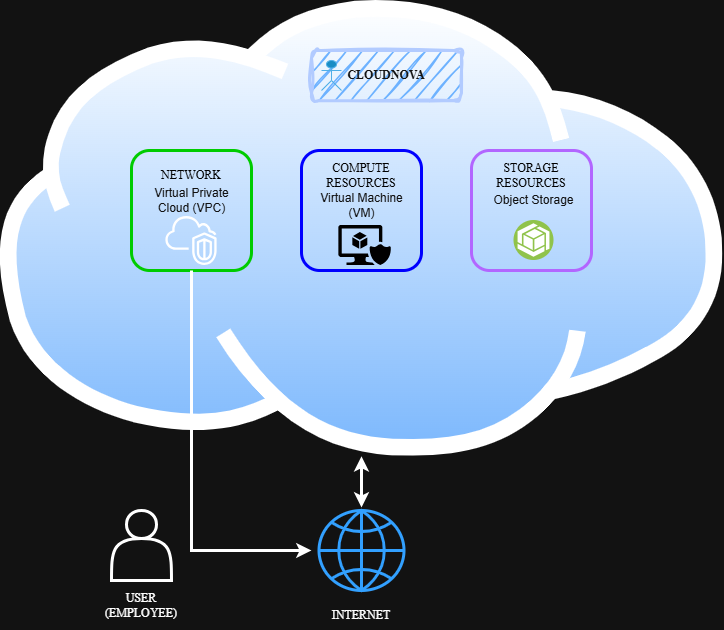

# Laboratory Activity 2 – Build the Cloud Infrastructure Blueprint

## Mission Overview

Congratulations,
Your onboarding has been successfully completed, and your Cloud Computing Portfolio has been approved by
your supervisor.
CloudNova Technologies has now assigned you to your first official project.
Before deploying cloud services, every cloud engineer must understand the infrastructure that powers modern
cloud computing. Your mission is to investigate the components of cloud infrastructure, identify how compute,
storage, networking, and identity services work together, and document your findings as if you were preparing
technical documentation for a client.
Using the KillerCoda Playground, Linux tools, official cloud documentation, and your GitHub Cloud Computing
Portfolio, you will complete a series of engineering tasks that simulate the planning phase of a cloud deployment.
Remember: Great cloud engineers build systems—but exceptional cloud engineers document and justify
every design decision.

---

## Objectives

The objectives of this laboratory activity were to:

- Explain the major components of cloud infrastructure.
- Investigate the hardware and software resources available in a Linux environment.
- Identify compute, storage, networking, and operating system resources.
- Understand the relationship between cloud infrastructure components.
- Create technical documentation using Markdown.
- Continue building a GitHub Cloud Computing Portfolio.
- Create a simple cloud infrastructure blueprint.

---

## Cloud Infrastructure Components

During the activity, I identified the main infrastructure components in the **KillerCoda Linux environment** and applied the concepts to my cloud infrastructure diagram.

### Compute Resources

The KillerCoda environment provided an **Intel Xeon E312xx processor**, with **1 CPU core** and approximately **1.9 GiB of RAM**.

In my cloud infrastructure diagram, the compute resource is represented by a **Virtual Machine (VM)**. The VM provides the processing resources needed to run applications and workloads.

### Storage Resources

The main storage device in the Linux environment was `/dev/vda1`, with a total capacity of approximately **19 GB**. Around **5.4 GB was being used**, while approximately **13 GB remained available**.

In my cloud infrastructure diagram, the storage resource is represented by **Object Storage**. It can be used to store files, objects, application data, and other information.

### Networking Resources

The Linux environment had the hostname **`ubuntu`** and the IP addresses **`172.30.1.2`** and **`172.17.0.1`**.

In my cloud infrastructure diagram, the network is represented by a **Virtual Private Cloud (VPC)**. The VPC provides the network environment that connects the cloud resources.

### Operating System

The KillerCoda server was running **Ubuntu 24.04.4 LTS** with kernel version **6.8.0-136-generic**.

The operating system provides the environment where Linux commands and applications can run while managing the available system resources.

---

## Cloud Infrastructure Diagram

The following diagram shows my **CloudNova** cloud infrastructure design.



### Diagram Components

| Component | CloudNova Example | Purpose |
|---|---|---|
| 👤 User | Employee | Accesses the cloud environment |
| 🌐 Internet | Internet | Connects the user to the cloud environment |
| 🔐 Network | Virtual Private Cloud (VPC) | Connects and manages communication between cloud resources |
| 🖥️ Compute | Virtual Machine (VM) | Runs applications and workloads |
| 💾 Storage | Object Storage | Stores files, objects, and application data |

### Infrastructure Flow

The basic flow of my cloud infrastructure design is:

**User → Internet → Network (VPC) → Compute Resource (VM) → Storage Resource (Object Storage)**

The user connects through the Internet to the CloudNova network. The VPC connects the cloud resources, while the Virtual Machine provides computing power and Object Storage provides a place to store data.

---

## Tools Used

The following tools were used during the laboratory activity:

- **KillerCoda** — Used to access and work with the cloud-based Linux environment.
- **Ubuntu Linux** — Used as the operating system for investigating the server environment.
- **Git** — Used to track changes and manage laboratory files.
- **GitHub** — Used to store the repository and maintain the Cloud Computing Portfolio.
- **Nano** — Used to create and edit Markdown files from the terminal.
- **Tree** — Used to view the organization of folders and files.
- **Web Browser** — Used to access the official documentation of AWS, Microsoft Azure, and Google Cloud.
- **ChatGPT** — Used as an assistance tool for explanations, grammar, organization, and Markdown formatting.

---

## Linux Commands Executed

The following Linux commands were used during the laboratory activity.

| Command | Description |
|---|---|
| `git clone` | Creates a local copy of a GitHub repository. |
| `lsb_release -a` | Displays information about the Linux distribution. |
| `uname -r` | Displays the Linux kernel version. |
| `lscpu \| grep "Model Name"` | Displays the CPU model information. |
| `nproc` | Displays the number of available CPU cores. |
| `free -h` | Displays RAM and memory information. |
| `df -h /` | Displays disk capacity and usage of the root filesystem. |
| `df -h` | Displays disk space usage for mounted filesystems. |
| `hostname` | Displays the hostname of the Linux system. |
| `hostname -I` | Displays the IP addresses assigned to the system. |
| `cd` | Changes the current working directory. |
| `mkdir` | Creates a new directory. |
| `touch` | Creates a new empty file. |
| `nano` | Opens a terminal-based text editor. |
| `tree` | Displays files and directories in a tree-like structure. |
| `cd ..` | Moves one level up in the directory structure. |
| `git add .` | Stages files for a commit. |
| `git commit -m "show folder"` | Saves changes to the local Git history. |
| `git push` | Uploads committed changes to GitHub. |
| `cat` | Displays the contents of a file. |

---

## Skills Learned

Through this activity, I learned how to identify and explain the basic components of cloud infrastructure. I became more familiar with how **compute, storage, networking, and operating systems** work together in a cloud environment.

I also improved my ability to use Linux commands to check system information, such as the CPU, memory, storage, hostname, and IP address.

Another skill I developed was creating and organizing documentation using **Markdown and GitHub**. I learned how to present technical information using headings, tables, code blocks, and diagrams.

I also learned how to create a simple cloud infrastructure design and understand how users, networks, virtual machines, and storage can be connected together.

---

## Challenges Encountered

One challenge I encountered was understanding the purpose of some of the Linux commands and the information shown in their output. I needed to carefully check the results to understand what each part of the system information meant.

I also found it challenging to organize the different infrastructure components into a clear cloud architecture diagram. I had to make sure that the **network, compute, storage, Internet, and user** were connected in a logical way.

Another challenge was making the documentation organized and easy to understand. I had to adjust the Markdown formatting, tables, and sections so that the information was presented clearly.

These challenges helped me improve my understanding of Linux and cloud infrastructure while also making me more confident in creating technical documentation.

---

## Conclusion

This laboratory activity gave me a better understanding of how the basic parts of cloud infrastructure work together.

By examining the **KillerCoda Linux environment**, I was able to identify actual examples of compute, storage, networking, and operating system resources.

My CloudNova diagram helped me apply these concepts to a simple cloud environment where the **user connects through the Internet to a VPC network, which connects to a Virtual Machine and Object Storage**.

Overall, this activity helped me improve my **Linux, Git, GitHub, cloud computing, infrastructure design, and technical documentation skills**.

---

## CloudNova Infrastructure Flow

```text
👤 USER
   │
   ▼
🌐 INTERNET
   │
   ▼
🔐 VIRTUAL PRIVATE CLOUD (VPC)
   │
   ├──────────────► 🖥️ VIRTUAL MACHINE
   │                      │
   │                      ▼
   │                💾 OBJECT STORAGE
   │
   └──────────────► CloudNova Network
