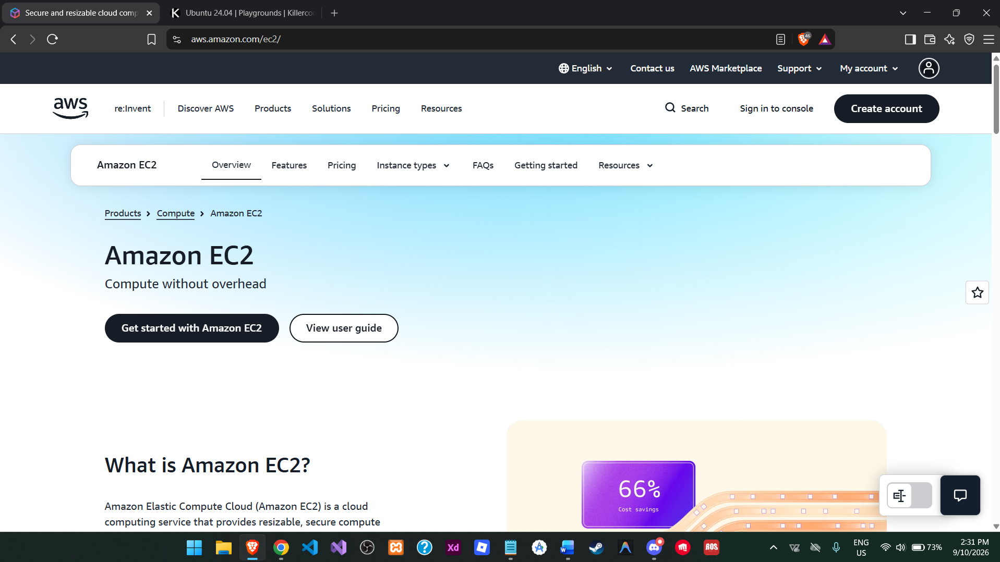

# ☁️ AWS Research

## 1. Brief Overview

Amazon Web Services (AWS) is a cloud computing platform from Amazon that provides a large collection of services for computing, storage, databases, networking, analytics, security, and application development. AWS allows organizations to use cloud resources without having to own and maintain all of the physical infrastructure themselves (Amazon Web Services [AWS], n.d.).

## 2. Global Infrastructure

AWS has a worldwide infrastructure organized into **Regions** and **Availability Zones (AZs)**. A Region is a separate geographic area, while Availability Zones are isolated locations within a Region. AWS also provides Local Zones, Wavelength Zones, and AWS Outposts for workloads that need lower latency or hybrid/on-premises deployment. AWS states that each Region has multiple Availability Zones to support highly available applications (AWS, 2026a, 2026b).

## 3. Cloud Management Console

The **AWS Management Console** is a web-based interface that provides centralized access to AWS services. It allows users to create and manage cloud resources, monitor service usage and health, manage users and permissions, view billing information, and work across different AWS Regions (AWS, 2026c).

## 4. Four Core Services

### 4.1 Amazon EC2

Amazon Elastic Compute Cloud (EC2) provides resizable virtual servers in the AWS Cloud. It can be used to host websites, applications, enterprise workloads, and other computing tasks (AWS, n.d.-a).

### 4.2 Amazon S3

Amazon Simple Storage Service (S3) is an object storage service used to store and retrieve data. It can support websites, mobile applications, backups, archives, data lakes, and enterprise applications (AWS, n.d.-b).

### 4.3 Amazon RDS

Amazon Relational Database Service (RDS) is a managed relational database service that makes it easier to set up, operate, and scale relational databases in the cloud (AWS, n.d.-c).

### 4.4 AWS Lambda

AWS Lambda is a serverless compute service that runs code without requiring users to manage servers. It automatically handles infrastructure and scaling for supported workloads (AWS, n.d.-d).

## 5. Three Advantages

1. **Scalability** – AWS resources can be increased or decreased according to workload requirements.
2. **Global reach** – Its worldwide Regions and Availability Zones allow organizations to deploy applications closer to users and improve availability.
3. **Large service ecosystem** – AWS provides services for computing, storage, databases, networking, security, analytics, AI, and many other enterprise needs.

## 6. Typical Enterprise Use Cases

- Hosting business websites and web applications.
- Storing company files, backups, and large datasets.
- Running relational databases for business applications.
- Building serverless and event-driven applications.
- Disaster recovery and business continuity.
- Data analytics, machine learning, and enterprise application modernization.

## References

Amazon Web Services. (n.d.). *Amazon EC2*. Retrieved September 10, 2026, from https://aws.amazon.com/ec2/

Amazon Web Services. (n.d.). *Amazon RDS*. Retrieved September 10, 2026, from https://aws.amazon.com/rds/

Amazon Web Services. (n.d.). *AWS Lambda*. Retrieved September 10, 2026, from https://aws.amazon.com/lambda/

Amazon Web Services. (n.d.). *Amazon S3*. Retrieved September 10, 2026, from https://aws.amazon.com/s3/

Amazon Web Services. (2026a). *AWS availability zones*. Retrieved September 10, 2026, from https://docs.aws.amazon.com/global-infrastructure/latest/regions/aws-availability-zones.html

Amazon Web Services. (2026b). *AWS regions*. Retrieved September 10, 2026, from https://docs.aws.amazon.com/global-infrastructure/latest/regions/aws-regions.html

Amazon Web Services. (2026c). *What is the AWS Management Console?* Retrieved September 10, 2026, from https://docs.aws.amazon.com/awsconsolehelpdocs/latest/gsg/what-is.html
