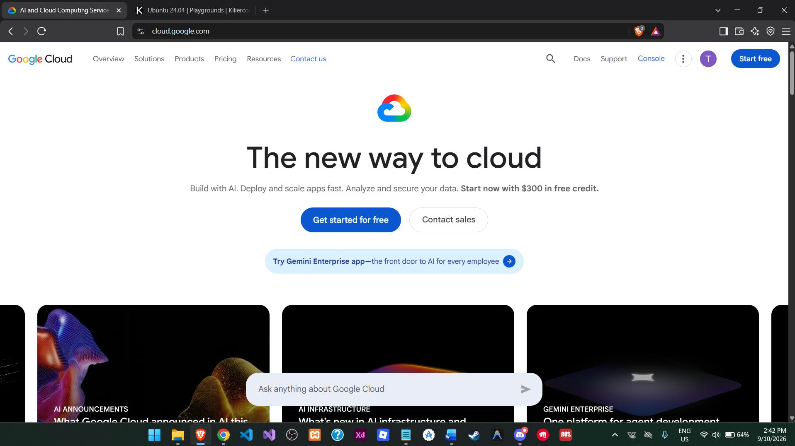

# 🌐 GCP Research

## 1. Brief Overview

Google Cloud Platform (GCP), commonly called Google Cloud, is Google's cloud computing platform. It provides services for computing, storage, databases, networking, data analytics, containers, application development, and artificial intelligence. Google Cloud allows organizations to run applications and store and analyze data using Google's global infrastructure (Google Cloud, n.d.).

## 2. Global Infrastructure

Google Cloud's infrastructure is organized into **regions and zones**. Regions are geographic locations, and zones are separate deployment areas within regions. Google Cloud also supports global and multi-region resources. Google Cloud states that it intends to offer at least three availability zones in every general-purpose region, helping organizations design applications with greater resilience (Google Cloud, 2026a, 2026b).

Google Cloud also operates a global network designed to provide high performance and low-latency connectivity between its cloud infrastructure and users around the world (Google Cloud, 2026a).

## 3. Cloud Management Console

The **Google Cloud console** is a browser-based graphical interface for managing Google Cloud resources. It provides access to projects, resources, billing information, activity, and Google Cloud Shell. Users can manage services through the console or use alternatives such as the Google Cloud CLI and REST APIs (Google Cloud, 2026c).

## 4. Four Core Services

### 4.1 Compute Engine

Compute Engine is an Infrastructure-as-a-Service (IaaS) product that provides virtual machines and bare metal instances on Google's infrastructure. It can be used for web servers, databases, enterprise applications, and customized workloads (Google Cloud, n.d.-a).

### 4.2 Cloud Storage

Cloud Storage is a managed object storage service used to store unstructured data in buckets. It can be used for application data, backups, archives, analytics datasets, and content distribution (Google Cloud, n.d.-b).

### 4.3 Cloud SQL

Cloud SQL is a fully managed relational database service supporting MySQL, PostgreSQL, and SQL Server. Google manages tasks such as backups, replication, patches, encryption, and storage capacity (Google Cloud, n.d.-c).

### 4.4 BigQuery

BigQuery is a fully managed, serverless data warehouse and analytics platform designed to analyze very large datasets. It supports near-real-time analytics and provides tools for data analysis, machine learning, and business intelligence (Google Cloud, n.d.-d).

## 5. Three Advantages

1. **Strong data and analytics capabilities** – Google Cloud provides services such as BigQuery for large-scale analytics.
2. **Global network and infrastructure** – Its global network and distributed regions support applications used by organizations around the world.
3. **Managed and scalable services** – Services such as Cloud SQL, Cloud Storage, and BigQuery reduce infrastructure management while allowing workloads to scale.

## 6. Typical Enterprise Use Cases

- Hosting websites, applications, and virtual machines.
- Large-scale data warehousing and business intelligence.
- Data analytics and machine learning.
- Storing backups, files, media, and enterprise datasets.
- Running containerized and cloud-native applications.
- Disaster recovery and global application deployment.
- Building data-driven and AI-powered business solutions.
  

## References

Google Cloud. (n.d.). *BigQuery*. Retrieved September 10, 2026, from https://cloud.google.com/bigquery

Google Cloud. (n.d.). *Cloud SQL*. Retrieved September 10, 2026, from https://cloud.google.com/sql

Google Cloud. (n.d.). *Cloud Storage*. Retrieved September 10, 2026, from https://cloud.google.com/storage

Google Cloud. (n.d.). *Compute Engine*. Retrieved September 10, 2026, from https://cloud.google.com/products/compute

Google Cloud. (2026a). *Global locations: Regions and zones*. Retrieved September 10, 2026, from https://cloud.google.com/about/locations

Google Cloud. (2026b). *Geography and regions*. Google Cloud Documentation. Retrieved September 10, 2026, from https://docs.cloud.google.com/docs/geography-and-regions

Google Cloud. (2026c). *Google Cloud console*. Google Cloud Documentation. Retrieved September 10, 2026, from https://docs.cloud.google.com/compute/docs/console

Google Cloud. (2026d). *Global, regional, and zonal resources*. Google Cloud Documentation. Retrieved September 10, 2026, from https://docs.cloud.google.com/compute/docs/regions-zones/global-regional-zonal-resources
