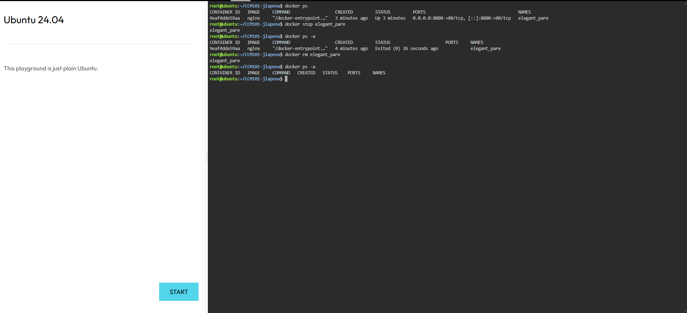

# 🐳 Container Lifecycle Management

> This activity demonstrates the basic lifecycle of a Docker container, from viewing and stopping it to completely removing it.

---

## 🟦 01 — List Running Containers

**Command:**

```bash
docker ps
```
📝 Explanation

Displays all Docker containers that are currently running.

## 🟨 02 — Stop the Running Container

**Command:**

```bash
docker stop <container-name-or-id>
```
📝 Explanation

Stops the currently running Nginx container using its container name or container ID.

## 🟩 03 — Verify the Container is Stopped

**Command:**

```bash
docker ps -a
```
📝 Explanation

Displays both running and stopped containers to verify that the Nginx container has been stopped.

## 🟥 04 — Remove the Container

**Command:**

```bash
docker rm <container-name-or-id>
```
📝 Explanation

Removes the stopped Nginx container completely from the Docker environment.

Example:
```bash
docker rm elegant_pare
```
## 🟪 05 — Verify Container Removal

**Command:**

```bash
docker ps -a
```
📝 Explanation

Checks the container list to confirm that the removed Nginx container no longer appears.

## 🔄 Container Lifecycle

📋 List
   ↓
🛑 Stop
   ↓
🔍 Verify
   ↓
🗑️ Remove
   ↓
✅ Confirm Removal

## 📸 Evidence

The following screenshot shows the execution of the Docker container lifecycle commands:




